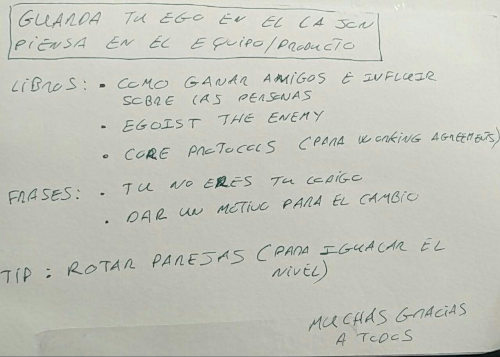
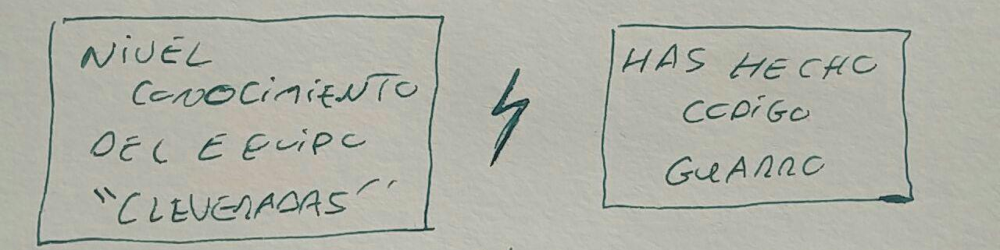

# Guarda tu ego en el cajón. Piensa en el equipo/producto
---

## Contexto incial del debate

Dos situaciones:

## Libros:

* [How to win friends and influence people](https://www.amazon.es/How-Win-Friends-Influence-People/dp/067142517X), de Dale Carnegie
* [Ego is the enemy](https://www.amazon.es/Ego-Enemy-Master-Greatest-Opponent-ebook/dp/B01AWUTMB0), de Ryan Holiday, en [español](https://www.amazon.es/El-Ego-Es-Enemigo/dp/6077473944)
* [The core protocols: a guide to greatness](https://www.amazon.es/Core-Protocols-Guide-Greatness/dp/0692381082), de Richard Kasperowski. Para working agreements

## Frases:

* Tu **no** eres tu código
* Dar motivo para el cambio
* Si quieres que alguien cambie, tienes que darle una motivación para que sea él quien quiera cambiar
* Hay ocasiones en las que las razones puramente técnicas **no** valen

## Tip

* Rotar parejas (iguala el nivel)
