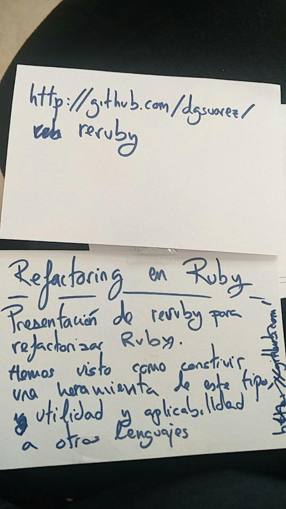

# Refactoring en Ruby
---

Presentación de [reruby](https://github.com/dgsuarez/reruby).

Hemos visto como construir una herramienta de este tipo, utilidad y
aplicabilidad a otros lenguajes.

* [Transparencias
  utilizadas](https://speakerdeck.com/dgsuarez/reruby-automated-refactoring-with-ruby).
* Uno de los temas tratados fue herramientas de refactoring y manipulación de
  código en otros lenguajes dinámicos como Javascript, en [esta
  issue](https://github.com/dgsuarez/reruby/issues/24) hay una recopilación de
  enlaces interesantes.
